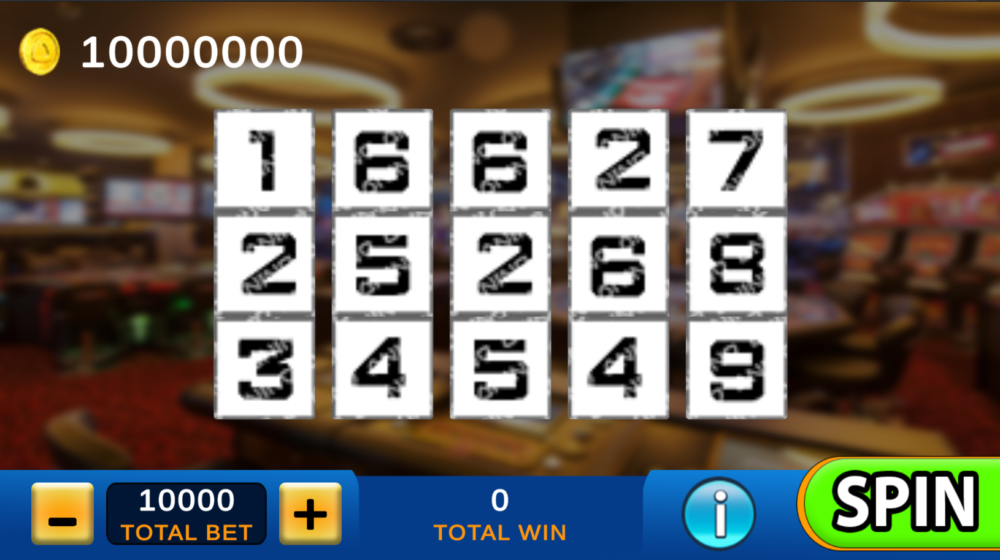
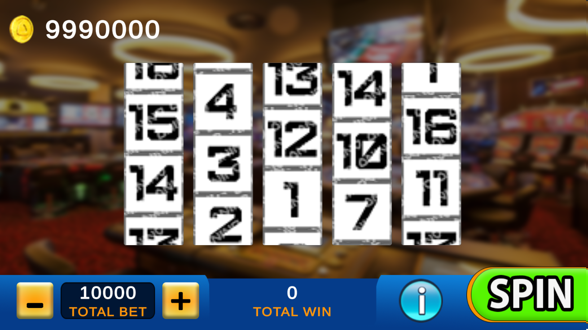

# Double Win Vegas

Made as a requirement for the recruitment process for Anino Games. The application was developed using **Unity3D 2021.3.22f1**

## Buttons
- "-" = Decrease Bet Amount
- "+" = Increase Bet Amount
- Spin = Spin the reels. Will also stop the reels if pressed while spinning.
- i = Show payout lines

## System setup
### Classes
1. Slot Controller
    * Manages most of the game
    * Reel data located in **Start**
    * DisplayPayoutLines() instantiates visual for Payout Lines
    * Line Renderers showing Payout Lines are generated on runtime. Payout Lines can be changed and UI will adapt accordingly.
    * GetRandomSymbol() get a random symbol from an array of int (reel)
    * IncreaseBet() and DecreaseBet() increases and decreases Bet base amount then multiplies to active Payout Lines to get totalBet
    * SpinStop() forces the 5 reels to stop spinning
    * Spin() checks if reels are spinning, if player has enough coins, and then initiates spin
    * GetSpinResult(int[] target, int[][] reelModels) gets a 3x5 array of int
    * CheckPayout(int[][] spinResult) using the 3x5 result array, it gets the combination of Symbols in reference to Payout Lines
    * ShowPayoutLines(bool value) enables/disables PayoutLineView GameObjects
    * CheckPayoutSymbols(int[] result, List<Symbol> symbols, int[] symbolPayouts) checks the symbols and counts total payout
1. Payout Lines
    * Contains data for Payout Lines
1. Player
    * Contains player's coins, and necessary functions to add and subtract
1. ReelView
    * View class for the Reels
    * Sets a velocity to the GameObjects scroll rect to simulate spinning
    * Once the velocity is bellow a certain threshold, jump to the predetermined result
1. Symbol
    * ScriptableObject, allows easy manipulation of Symbols. Created ScriptableObjects will automatically be added to the Catalog however indexes of new Symbols needs to be manually added to the Reel Data located in Slot Controler
1. SymbolCatalog
    * Responsible for loading Symbols from Resources
1. TotalWin, Bets, PlayerCoins
    * View classes responsible for updated UI text
    
MVC pattern is implemented to an extent, however it goes without saying that the project can be cleaned further but the current time restriction may prove to be challenging. Data used for the Reels, and Payout Lines are easily editable and can be moved to a function that can read data from outside the application. As previously mentioned, Symbols are easily added to the application by simply creating Scriptable Objects.  

## Screenshots
**Idle**  

**Spinning**  

## References
1. [Double Win Vegas](https://play.google.com/store/apps/details?id=ppl.unity.cubeslots&hl=en)
1. [Background image](https://www.linkedin.com/company/inter-amusement-group)
1. [20 Payline Slots Games](http://www.onlineslots4u.com/paylines/20/)
1. [How to scroll to a specific element in ScrollRect with Unity UI?](https://stackoverflow.com/a/30769550) by [makysmiuk](https://stackoverflow.com/users/4979159/maksymiuk)
